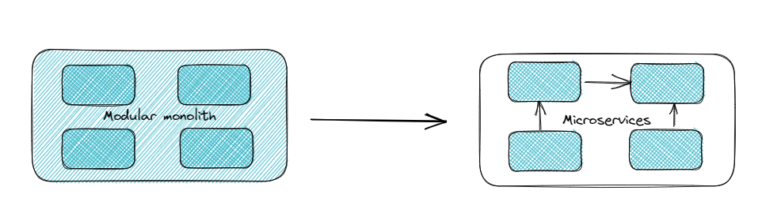

# Our approach to microservices

Most people today think the ideology of splitting software into smaller pieces came from the microservices architecture, however, this is a good practice established and followed in software development and strictly followed by the engineers at xgeeks.

A perfect example is the “Unix philosophy”, which is not only a few good practices written in a paper but something proved and tested in Unix itself. There are some of the main rules they followed:

* Write simple parts connected by clean interfaces
* Design programs to be connected to other programs
* Separate policy from mechanism; separate interfaces from engines

No, they have not described microservices.

These principles were defined back in the 70s and they are referring to the good practices we should adopt in code design.

The boost of the microservices was caused by the growth of cloud-native tools in the last years that turn it easy to apply it in every software solution we see today. Most of the cloud solutions prioritize automation, virtualization and containerization, leading us to different kinds of infrastructure we were used to, mainly because it turned easy to implement a distributed system in form of microservices. Some of the tools that contributed to this boost were:

* Docker: which popularized containerization;
 * Kubernetes: that allowed to orchestrate containers and all the infrastructure around them;
* CI/CD tools: such as GitHub Actions or Flux CD, contribute mainly to simplifying the deployments of new features, integrating them easily and quickly in a production environment.

## It’s a trend, we need to use it everywhere

 Since it was easier to implement and became somehow a trend in software architecture, its use became the first option independent of which case we are working on.

We are all aware of the advantages of microservices, such as:

* Scalability
* Reusability
* Simpler to deploy
* Improve team management
* Fault tolerance

But, as with everything in life, it has its downsides and problems if it is not applied correctly and for the right purpose.

One of the common errors that people make is to start using it at the beginning of a new project. This is highly not recommended since it can lead to costs you are not thinking about at this point. This happens because we start believing that we already have the infrastructure and the automation mechanisms ready, but this is part of the work before you even think about building microservices.

We usually say that microservices reduce the complexity of the application, but we are just passing the complexity to other levels. You might need to think about logging centralization, monitoring and other points in the infrastructure you might not be used to thinking about.

The testing is more manageable if you are talking about the unit tests because they are restricted to the microservice you are testing. However, integration tests become a nightmare. In this architecture, you can’t test all the microservices involved on a specific functionality locally, even to integrate them in your pipeline, you will need to build an independent test environment and use an external tool to run the tests. Resuming, more complexity and more costs to your pocket since we need more resources to implement the test environment.

 The communication between the different microservices starts to use the network and with that, all the problems associated with it start to appear. Instead of the flow passing through the same process we need to define interfaces to allow this communication, mainly using the network. This might not be a problem, however, you will always introduce asynchronous processes and latency.

At xgeeks we believe good engineering is understanding the problem and tackling it with the best tool, not the trendy tool and this post aims to show how we look at cloud-native plus microservices and demystify its hype. So, let's go deep into it.

## Most of the time you can solve it with a monolith

One of the biggest advantages of micro-services is that you can work on a particular service, and if no changes are done to its interface then no other service is affected. But one of the concepts that are often overlooked is the Modular Monolith, in reality, a modular monolith is a monolith done right. One thing that can be said for sure is that if you’re not able to properly design a monolith then you sure won't be able to design a microservice architecture.

Here we argue that most of the benefits of microservices can be achieved with a well-thought-out monolith, that way the hardest parts of a fully distributed system are not present, and it might actually be the best option for the project you are working on.

If the separation of domains is not clear and concise, then you end up with a distributed monolith, which is one of the biggest pitfalls of microservices. So if you implement a truly modular monolith you are much closer to migrating to microservices if needed.

The ability to deploy a single part of your system is one of the hallmarks of microservices. Let’s say you update a feature and you want to do some beta testing in production, you are now able to deploy the affected service and only route 10% of your requests. Again monoliths can achieve the same, if code is structured in a way that a new feature doesn’t touch multiple contexts, then from the programmer’s point of view it's just the same. The caveat is that you have to deploy the whole system, which incurs more costs, something we’ll look into in more detail further ahead.

Reliability is another big topic, but reliability is more about using cloud-native tools and the way you use them. It's not because Netflix uses a microservice architecture that their application has close to zero downtime. It’s the strategies and methodologies they put in place that allow them to keep operating as usual when a whole AWS region becomes unstable. (lint to chaos monkey article here)

Just like with microservices, with monoliths, you can still apply various design patterns like DDD. One of the benefits of having a full microservice architecture is that data is bounded to its own domain, and each microservice has its own data storage. That guarantees that some other piece of code(or service) won’t do unexpected changes to that data.
Again monoliths can achieve this! Even if the database server is shared by all modules, if well implemented a great deal of domain separation can be achieved with proper design.

A good modularized architecture with clear domain separation, won’t get in the way of your organization and the way you structure teams. You can still build teams around certain contexts. At xgeeks we keep that in mind, where a team is tasked with developing a finite number of modules (or microservices) that encapsulate a set of features, that way we allow our engineers to be specialists in their own domain, with full ownership.
Git is an amazing tool and when you’re able to implement a new feature without making changes across multiple domains (unless required by the nature of the feature), integrating new code is not much more complicated than managing it across multiple repositories, in some scenarios it might even be the best option. Managing a mono repository has its complications, but it has the advantage that your CI/CD pipelines are all in one place.

The bottom line, modularity comes more from domain separation than from pieces of code running in multiple containers.

Just like in microservices, you can make use of another design pattern to implement your modular monolith. DDD is a good example of it, you can start with somewhat big modules that encapsulate a bounded context, that you can further break apart into multiple modules each with fewer aggregates.

One thing you cannot do with a monolith is used multiple languages, but in the real world, rare is the case that there is a real need to use specific technologies for certain tasks and to be able to develop and support a heterogeneous system, you need a mature and robust organization. Otherwise, you are just going to end up with bad code in different languages, or with whole parts of the system only owned by a very small group of very expensive specialists.

When we talk about modularity, two big concepts arise, coupling and cohesion. Here Sam Newman said it best in his book, Monolith to Microservices:

`"Cohesion and coupling are concerns regarding modular software, and what is microservice architecture other than modules that communicate via networks and can be independently deployed?"`

Just to reiterate, modularity is one of the biggest concerns of microservices, but that is not inherent to them, which comes from a project that has been designed and structured to have the highest standard of software design.

## It’s not “if”, but “when”

As we have discussed so far, the point is not if we should use microservices, but when this architecture fits better.

In fact, choosing to follow this architecture in the early stages of a project, without having the support and the expertise on the team side, will create a negative impact on the solution and more precisely on the business.

So, the question you need to ask is “When should I use a microservices architecture?”

If you are thinking in design a system based on microservices, you must know that are some requirements you must adhere to:

* You have a standard logging format across the multiple services in order to achieve centralization;
* The services expose metrics and data in a common way to implement [observability systems](https://medium.com/xgeeks/challenges-and-solutions-of-observability-in-cloud-native-applications-32bf7b9a8425);
* Each service must have an independent integration and deployment process;
* Grant data isolation in a way that just the service in that domain has access to it;
* Providing service discovery and load balancing;
* Define security measures throughout the services.

Apart from the microservices, in xgeeks we follow some principles to ensure that distributed teams can contribute to the system independently by following three main principles:

1. Code design
As we have said before, microservices can lead us to make the teams more independent and autonomous, however, this can be the opposite in some cases. One example is when you start to create microservice tightly coupled to each other and run them in separate deployments. This will not make your software modular, you are just creating a distributed monolith without taking any benefit from it.

As we said before, Modularity is the point we want to reach, being the right way to design code, and consequently, “microservices ready” is with domain-driven design most of the time. By understanding the boundaries of each Bounded Context we will be able to understand the granularity of each service and how we can optimize for it to be as independent as possible from other services. Having clearly defined Bounded.

2. Team topology
Taking the previous topic, in xgeeks we believe the best way to organize teams is to take into account the code design itself. If the code design applied is based on the business domains and as independent as possible from each other, the teams will be able to add more value to the overall system by clearly separating their responsibilities by domain.

3. Independent release pipeline
Since we have our code design properly defined and it has the domain's context well defined, we not only have the teams split by domain, but also we can define different and independent releases pipelines.

Following these points mentioned before, we have all the advantages that most of the time are, wrongly, only linked to microservices, but as we explained in the previous sections, these advantages are more related to the code design and the way we implement the modules in the software. So, we usually start with a modular monolith and then we migrate it by implementing microservices at the time we need to do it in order to improve the system. Once again, we don't need to implement microservices if we don't take benefit from them, this is just the usual path in the development cycle.

## Migrate a monolith to microservices
The usual scenarios we see today are the need to migrate an huge monolith application and rewrite it using a different architecture and sometimes a different programming language.

This kind of migration can take different paths, but usually, we start to define the desired architecture we want to reach and divide the process into different phases. Defining migration phases allow us to iterate over the time the different components of the system, which sometimes we have part of the old monolith working together with the new services.

As you might know, this migration is not all about changing the monolith into microservices, but it is also an opportunity to re-write some functionalities and choose other technologies that fits better our needs. For example, you might consider the use of a different programming language or even include some other architectures in some parts of you system.

If you are going through a migration process, **you shouldn't do it all at once.** The idea is to divide all the sections of the new architecture and start developing them independently of each other, allowing to put different teams working in parallel. Once you get a module ready, you are able to start using it even if the rest is not done yet. 

## Final thoughts

As with everything in software engineering, in xgeeks, we take all the information about one solution and verify if it resolves properly our problem, without generating other ones more complex.

Microservices are really good when we have all the conditions discussed in this article joined together, otherwise, you must have the notion that you don’t need to apply it in everything you work on just because someone else is using it.

**Prioritize the code design in order to achieve modularity** so you don’t need to think about microservices in the first place.
